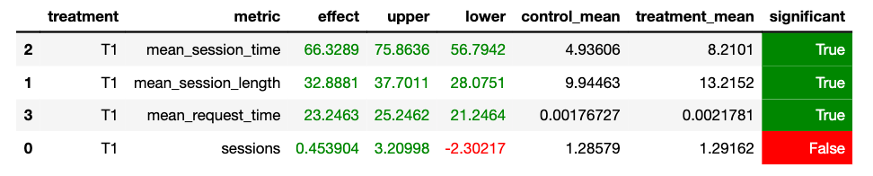

## МОБОД-RecSys: Домашнее задание.

### 1. Абстракт

В данном задании требовалось предоставить улучшение сервиса botify. Под улучшением подразумевается увеличение по ключевой метрике mean_session_time, а также остальным. На момент выполнения задания лучшим рекоммендером является Contextual, мое решение - ContextualUpdated. Изменения рекоммендера, приведшие к улучшению метрик можно разделить на две группы: изменения в датасете и добавление эвристик. Подробнее каждое из них описано в следующем разделе. По результатам изменений были получены статистически значимые улучшения по метрикам mean_session_time, mean_request_time и mean_session_length.

### 2. Детали

#### 2.1 Датасет
Новый датасет был получен следующим образом. За основу берется рекоммендер Contextual и с помощью него генерируются логи для 100.000 сессий. Из этих логов с помощью NN генерируются эмбеддиги треков, из них получаем соответствие трек - рекомендаций (100 штук). рекомендаций генерируются не с помощью np.argpartition (порядок элементов в партициях неопределен), а с помощью np.argsort (то есть строгий порядок для первых k треков.) Также была изменена размерность эмбеддингов со 100 до 200. В итоге получаем recommendations_nn.json, который используется для получения рекомендаций в ContextualUpdated. Процесс получения датасета описан в _get_recommendations.ipynb_
#### 2.2 Эвристики
ContextualUpdated от Contextual отличается наличием различных эвристик. Среди них -- в качестве fallback-а используется не Random-рекоммендер, а user-based recommender на recommendations_svd.json. Таким образом получается своего рода блэнд двух рекоммендеров (с Contextual на recommendations_nn.json в качестве основного). Следующая эвристика -- использование fallback-а
в случае, когда время прослушивания предыдущего трека меньше 0.1. Идея заключается в том, что если время прослушивания низкое, то рекомендация неудачная, и следующие рекомендации по цепочке будут такими же. Поэтому переходим к user-based подходу и кардинально меняем рекомендацию. Если же не удается подобрать рекомендацию, то возращается sticky_artist из самого первого трека пользователя. Идея: первый трек пользователь выбирает сам, а значит с большой вероятностю трек того же исполнителя ему подойдет. Для этого логируется история прослушиваний пользователей. Эту идею с историей можно развить сильнее -- если среднее время последних трех треков низкое, то опять идем в sticky_artist первого трека. Также в самом user-based рекоммендере fallback был изменен на top-pop. Была еще идея время от времени просто предлагать юзеру что-то из top-pop (с вероятностью 10%), но эта идея только ухудшала метрики.

### 3. Результаты A/B эксперимента

В качестве A/B теста проводится сравнение Contextual на данных tracks_with_recs.json (контроль группа) с Contextual_updated на recommendations_nn.json данных (treatment группа). В тесте было проведено 5000 сессий. Это значение было установлено эмпирически с целью нивелирования случайностей при тесте (т.е. при одних и тех же входных данных теста получаются одни и те же результаты в плане стат. значимости)

Результаты A/B теста: 
Результаты можно произвести, запустив ноутбук _jupyter/conduct_ab_test.ipynb_

### 4. Инструкция

1. Склонировать репозиторий: git clone
2. Зайти на удаленный сервер по ssh, создать директории и окружения:
- ssh -L 16006:127.0.0.1:30007 <user>@mipt-client.atp-fivt.org
- mkdir jupyter
- mkdir data
- Старуем ноутбук и устанавливаем окружение (инструкции описаны в botify/README.md)
2. Отправить на удаленный сервер ноутбуки и данные: 
- scp botify/data/* <user>@mipt-clinet.atp-fivt.org:data
- scp jupyter/* <user>@mipt-clinet.atp-fivt.org:jupyter
3. Шаги 4-6 выполняются с помощью run.sh-скрипта (локально)
- chmod +x run.sh
- ./run.sh
Если по какой-то причине скрипт не выполняется и это нельзя быстро исправить, то можно попробовать по шагам (4-6), иначе перейти к шагу 7.
4. Локально поднять докер-контейнеры: docker compose up -d --build
5. Дождаться, когда поднимутся докер-контейнеры (несколько минут для redis) и запустить симуляцию с текущим рекоммендером: 
- cd sim
- export PYTHONPATH=${PWD}
- python sim/run.py --episodes 5000 --recommender remote --config config/env.yml --seed 42
6. Прокинуть логи симуляции в hdfs:
- cd ../script
- export PYTHONPATH=${PWD}
- python dataclient.py --user mob202299 log2hdfs --cleanup updated_recommender

7. Запустить на сервере ноутбук _jupyter/conduct_ab_test.ipynb_ и получить результаты A/B-теста.

### 5. Комментарии
Выражаю благодарность преподавателям курса за прочитанные лекции и классное домашнее задание. Материал структурирован хорошо и последовательно, семинары также были очень полезны. Было интересно протестировать множество различных гипотез в попытках улучшить рекоммендер (отдельная благодарность за наличие симуляции, приближающей процесс рекомендации к реальному). Вообще ощущался дух kaggle-like соревнований, однако тут задача максимально связана с повседневной жизнью, так что ее решать было особенно увлекательно. В результате удалось убедиться в том, что можно добиться хороших результатов на простых эвристиках (до начала курса я думал, что рекомендательные системы это только сложные архитектуры НС), попробовать разные алгоритмы и их бленды и ощутить нехватку логирования результатов экспериментов и датасетов (не хватало какого-то MLFlow с dvc при большом количестве гипотез).
Так что после этого курса однозначно есть желание поработать над реальными рекомендательными системами в компании, за это спасибо вам!